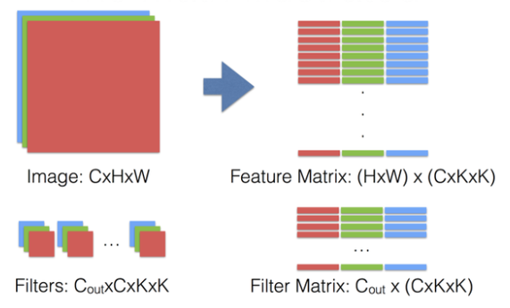
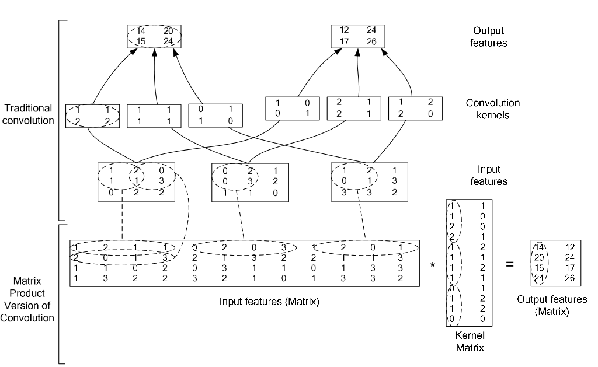

# Notes for implementation of caffe project

tags: Deep Learning, Computer Vision, Framework

Tutorial for caffe : **[Caffe tutorial](http://caffe.berkeleyvision.org/tutorial)**

### Reference

* [http:\/\/demo.netfoucs.com\/danieljianfeng\/article\/details\/42929283](http://demo.netfoucs.com/danieljianfeng/article/details/42929283)
* [http:\/\/www.shwley.com\/index.php\/archives\/68\/](http://www.shwley.com/index.php/archives/68/)
* [http:\/\/blog.csdn.net\/tangwei2014\/](http://blog.csdn.net/tangwei2014/)
* [http:\/\/zhangliliang.com\/](http://zhangliliang.com/)

### Implememtation of layers

Tutorial for [Layers](http://caffe.berkeleyvision.org/tutorial/layers.html)

#### layer.hpp

和layer相关的头文件有：

```
common_layers.hpp
data_layers.hpp
layer.hpp
loss_layers.hpp
neuron_layers.hpp
vision_layers.hpp
```

其中`layer.hpp`是抽象出来的基类，其他都是在其基础上的继承，也即剩下的五个头文件。在`layer.hpp`头文件里，包含了这几个头文件：

```cpp
#include "caffe/blob.hpp"
#include "caffe/common.hpp"
#include "caffe/proto/caffe.pb.h"
#include "caffe/util/device_alternate.hpp"
```

在device\_alternate.hpp中，通过`#ifdef CPU_ONLY`定义了一些宏来取消GPU的调用：

```cpp
#define STUB_GPU(classname)
#define STUB_GPU_FORWARD(classname, funcname)
#define STUB_GPU_BACKWARD(classname, funcname)
```

layer中有这三个主要参数：

```cpp
LayerParameter layer_param_;                // 这个是protobuf文件中存储的layer参数
vector<share_ptr<Blob<Dtype>>> blobs_;      // 这个存储的是layer的参数，在程序中用的
vector<bool> param_propagate_down_;         // 这个bool表示是否计算各个blob参数的diff，即传播误差
```

Layer类的构建函数`explicit Layer(const LayerParameter& param) : layer_param_(param)`会尝试从protobuf文件读取参数。\( The only thing we do is to copy blobs if there are any. \)
其三个主要接口：

```cpp
virtual void SetUp(const vector<Blob<Dtype>*>& bottom, vector<Blob<Dtype>*>* top)
inline Dtype Forward(const vector<Blob<Dtype>*>& bottom, vector<Blob<Dtype>*>* top);
inline void Backward(const vector<Blob<Dtype>*>& top, const vector<bool>& propagate_down, const <Blob<Dtype>*>* bottom);
```

---

`SetUp`函数需要根据实际的参数设置进行实现，对各种类型的参数初始化；`Forward`和`Backward`对应前向计算和反向更新，输入统一都是`bottom`，输出为`top`，其中`Backward`里面有个`propagate_down`参数，用来表示该`Layer`是否反向传播参数。

在`Forward`和`Backward`的具体实现里，会根据`Caffe::mode()`进行对应的操作，即使用`cpu`或者`gpu`进行计算，两个都实现了对应的接口`Forward_cpu`、`Forward_gpu`和`Backward_cpu`、`Backward_gpu`，这些接口都是`virtual`，具体还是要根据layer的类型进行对应的计算（注意：有些layer并没有GPU计算的实现，所以封装时加入了CPU的计算作为后备）。另外，还实现了`ToProto`的接口，将Layer的参数写入到protocol buffer文件中。

#### data\_layers.hpp

data\_layers.hpp这个头文件包含了这几个头文件：

```cpp
#include "boost/scoped_ptr.hpp"
#include "hdf5.h"
#include "leveldb/db.h"
#include "lmdb.h"
#include "caffe/blob.hpp"
#include "caffe/common.hpp"
#include "caffe/filler.hpp"
#include "caffe/internal_thread.hpp"
#include "caffe/layer.hpp"
#include "caffe/proto/caffe.pb.h"
```

`data_layer`作为原始数据的输入层，处于整个网络的最底层，它可以从数据库leveldb、lmdb中读取数据，也可以直接从内存中读取，还可以从hdf5，甚至是原始的图像读入数据。

关于这几个数据库，简介如下：

* [LevelDB](https://zh.wikipedia.org/wiki/LevelDB)是Google公司搞的一个高性能的key\/value存储库，调用简单，数据是被Snappy压缩，据说效率很多，可以减少磁盘I\/O。
* [LMDB（Lightning Memory-Mapped Database）](http://symas.com/mdb/)，是个和levelDB类似的key\/value存储库，但效果似乎更好些，其首页上写道“ultra-fast，ultra-compact”
* [HDF（Hierarchical Data Format](https://zh.wikipedia.org/wiki/HDF)是一种为存储和处理大容量科学数据而设计的文件格式及相应的库文件，当前最流行的版本是HDF5,其文件包含两种基本数据对象：
  * 群组（group）：类似文件夹，可以包含多个数据集或下级群组；
  * 数据集（dataset）：数据内容，可以是多维数组，也可以是更复杂的数据类型。


`caffe/filler.hpp`的作用是在网络初始化时，根据layer的定义进行初始参数的填充，下面的代码很直观，根据`FillerParameter`指定的类型进行对应的参数填充。

```cpp
// A function to get a specific filler from the specification given in
// FillerParameter. Ideally this would be replaced by a factory pattern,
// but we will leave it this way for now.
template <typename Dtype>
Filler<Dtype>* GetFiller(const FillerParameter& param) {
  const std::string& type = param.type();
  if (type == "constant") {
    return new ConstantFiller<Dtype>(param);
  } else if (type == "gaussian") {
    return new GaussianFiller<Dtype>(param);
  } else if (type == "positive_unitball") {
    return new PositiveUnitballFiller<Dtype>(param);
  } else if (type == "uniform") {
    return new UniformFiller<Dtype>(param);
  } else if (type == "xavier") {
    return new XavierFiller<Dtype>(param);
  } else {
    CHECK(false) << "Unknown filler name: " << param.type();
  }
  return (Filler<Dtype>*)(NULL);
}
```

`internal_thread.hpp`里面封装了`pthread`函数，继承的子类可以得到一个单独的线程，主要作用是在计算当前的一批数据时，在后台获取新一批的数据。

#### neuron\_layers.hpp

输入了data后，就要计算了，比如常见的`sigmoid`、`tanh`等等，这些都计算操作被抽象成了`neuron_layers.hpp`里面的类`NeuronLayer`，这个层只负责具体的计算，因此明确定义了输入`ExactNumBottomBlobs()`和`ExactNumTopBlobs()`都是常量1,即输入一个blob，输出一个blob。

#### common\_layers.hpp

`NeruonLayer`仅仅负责简单的一对一计算，而剩下的那些复杂的计算则通通放在了`common_layers.hpp`中。像`ArgMaxLayer`、`ConcatLayer`、`FlattenLayer`、`SoftmaxLayer`、`SplitLaye`r和`SliceLaye`r等各种对blob增减修改的操作。

#### loss\_layers.hpp

前面的`data_layer`和`common_layer`都是中间计算层，虽然会涉及到反向传播，但传播的源头来自于`loss_layer`，即网络的最终端。这一层因为要计算误差，所以输入都是2个blob，输出1个blob。

#### vision\_layers.hpp

`vision_layer`主要是图像卷积的操作，像`convolusion`、`pooling`、`LRN(Local Response Normalization )`都在里面。里面有个im2col的实现，主要是为了加速卷积的，具体见下`Convolution Layer`。

#### Some math functions

`caffe_cpu_gemm` : C ← αA × B + βC

```cpp
// A: M*K; B: K*N; C : M*N
template <typename Dtype>
void caffe_cpu_gemm(const CBLAS_TRANSPOSE TransA,
    const CBLAS_TRANSPOSE TransB, const int M, const int N, const int K,
    const Dtype alpha, const Dtype* A, const Dtype* B, const Dtype beta,
    Dtype* C)
```

`caffe_cpu_gemv`: Y ← αAX + βY

```cpp
// A: M*N; X: N*1; Y: M*1
void caffe_cpu_gemv<float>(const CBLAS_TRANSPOSE TransA, const int M,
    const int N, const float alpha, const float* A, const float* x,
    const float beta, float* y) 
```

The function of blas : [url](https://developer.apple.com/library/mac/documentation/Accelerate/Reference/BLAS_Ref/index.html#//apple_ref/c/func/cblas_sgemm)

---

#### Innerproduct layer

Tutorial: [http:\/\/ufldl.stanford.edu\/tutorial\/supervised\/MultiLayerNeuralNetworks\/](http://ufldl.stanford.edu/tutorial/supervised/MultiLayerNeuralNetworks/)

variables:

* M\_ 表示的样本数
* K\_ 表示单个样本的特征长度
* N\_ 表示输出神经元的个数

##### Forward\_cpu

```cpp
// y <- wx (y <- xw')
caffe_cpu_gemm<Dtype>(CblasNoTrans, CblasTrans, M_, N_, K_, (Dtype)1.,
      bottom_data, weight, (Dtype)0., top_data);
  if (bias_term_) {
// y <- y + b 
    caffe_cpu_gemm<Dtype>(CblasNoTrans, CblasNoTrans, M_, N_, 1, (Dtype)1.,
        bias_multiplier_.cpu_data(),
        this->blobs_[1]->cpu_data(), (Dtype)1., top_data);
  }
```

##### Backward\_cpu

* top\_diff: $$\delta^{(l+1)}$$
* bottom\_data: $$a^{(l)}$$
* this-&gt;blobs\_\[0\]-&gt;mutable\_cpu\_diff\(\): $$\Delta W^{(l)}$$
* this-&gt;blobs\_\[1\]-&gt;mutable\_cpu\_diff\(\): $$\Delta b^{(l)}$$
* bottom\[0\]-&gt;mutable\_cpu\_diff\(\): $$\delta^{(l)}$$

* Update $$\Delta W^{(l)}$$ : $$ \displaystyle \Delta W^{(l)} = \Delta W^{(l)} + \nabla\_{W^{(l)}} J(W,b; x,y) = \Delta W^{(l)} + \delta^{(l+1)}(a^{(l)})^T$$

  $$\displaystyle \frac{\partial}{\partial W_{ij}^{(l)}} J(W,b; x,y) = a_j^{(l)}\delta_i^{(l+1)}$$


```cpp
// Gradient with respect to weight
caffe_cpu_gemm<Dtype>(CblasTrans, CblasNoTrans, N_, K_, M_, (Dtype)1.,
    top_diff, bottom_data, (Dtype)0., this->blobs_[0]->mutable_cpu_diff());
```

* Update $$\Delta b^{(l)}$$ : $$\displaystyle \Delta b^{(l)} = \Delta b^{(l)} + \nabla\_{b^{(l)}} J(W,b; x,y) = \Delta b^{(l)} + \delta^{(l+1)}$$   
  $$\displaystyle \frac{\partial}{\partial b_{i}^{(l)}} J(W,b; x,y) = \delta_i^{(l+1)}$$


```cpp
// Gradient with respect to bias
caffe_cpu_gemv<Dtype>(CblasTrans, M_, N_, (Dtype)1., top_diff,
    bias_multiplier_.cpu_data(), (Dtype)0.,
    this->blobs_[1]->mutable_cpu_diff());
```

* Update $$\delta^{(l)}$$ : $$\displaystyle \delta^{(l)} = \left((W^{(l)})^T \delta^{(l+1)}\right)\times f'(z^{(l)})$$.   
  $$f'(\cdot)$$ implemented in `reluLayer`

```cpp
// Gradient with respect to bottom data
caffe_cpu_gemm<Dtype>(CblasNoTrans, CblasNoTrans, M_, K_, N_, (Dtype)1.,
    top_diff, this->blobs_[0]->cpu_data(), (Dtype)0.,
    bottom[0]->mutable_cpu_diff());
```

---

#### Convolution layer

Tutorial: [http:\/\/ufldl.stanford.edu\/tutorial\/supervised\/ConvolutionalNeuralNetwork\/](http://ufldl.stanford.edu/tutorial/supervised/ConvolutionalNeuralNetwork/)

Using `im2col` to convert the images to a matrix\(columns\). Computation becomes multiplication pf matrices.





```cpp
template <typename Dtype>
void im2col_cpu(const Dtype* data_im, const int channels,
        const int height, const int width, const int kernel_h, const int kernel_w,
        const int pad_h, const int pad_w,
        const int stride_h, const int stride_w,
        Dtype* data_col) {

    int height_col = (height + 2 * pad_h - kernel_h) / stride_h + 1;
    int width_col = (width + 2 * pad_w - kernel_w) / stride_w + 1;
    int channels_col = channels * kernel_h * kernel_w;

    for (int c = 0; c < channels_col; ++c) {
        int w_offset = c % kernel_w;
        int h_offset = (c / kernel_w) % kernel_h;
        int c_im = c / kernel_h / kernel_w;

        for (int h = 0; h < height_col; ++h) {
            for (int w = 0; w < width_col; ++w) {
                int h_pad = h * stride_h - pad_h + h_offset;
                int w_pad = w * stride_w - pad_w + w_offset;

                if (h_pad >= 0 && h_pad < height && w_pad >= 0 && w_pad < width)
                    data_col[(c * height_col + h) * width_col + w] =
                        data_im[(c_im * height + h_pad) * width + w_pad];
                else
                    data_col[(c * height_col + h) * width_col + w] = 0;
            }
        }
    }
}
```

After using `im2col` function, it is similar as Innerproduct Layer

##### Forward\_cpu

```cpp
for (int n = 0; n < this->num_; ++n) {
    this->forward_cpu_gemm(bottom_data + bottom[i]->offset(n), weight,
        top_data + top[i]->offset(n));
    if (this->bias_term_) {
        const Dtype* bias = this->blobs_[1]->cpu_data();
        this->forward_cpu_bias(top_data + top[i]->offset(n), bias);
    }
}
```

```cpp
template <typename Dtype>
void BaseConvolutionLayer<Dtype>::forward_cpu_gemm(const Dtype* input,
    const Dtype* weights, Dtype* output, bool skip_im2col) {
  const Dtype* col_buff = input;
  if (!is_1x1_) {
    if (!skip_im2col) {
      conv_im2col_cpu(input, col_buffer_.mutable_cpu_data());
    }
    col_buff = col_buffer_.cpu_data();
  }
  for (int g = 0; g < group_; ++g) {
    caffe_cpu_gemm<Dtype>(CblasNoTrans, CblasNoTrans, conv_out_channels_ /
        group_, conv_out_spatial_dim_, kernel_dim_ / group_,
        (Dtype)1., weights + weight_offset_ * g, col_buff + col_offset_ * g,
        (Dtype)0., output + output_offset_ * g);
  }
}
```

```cpp
template <typename Dtype>
void BaseConvolutionLayer<Dtype>::forward_cpu_bias(Dtype* output,
    const Dtype* bias) {
  caffe_cpu_gemm<Dtype>(CblasNoTrans, CblasNoTrans, num_output_,
      height_out_ * width_out_, 1, (Dtype)1., bias, bias_multiplier_.cpu_data(),
      (Dtype)1., output);
}
```

##### Backward\_cpu

$$\displaystyle \nabla\_{W^{(l)}_k} J(W,b; x,y) = \sum\_{i = 1}^{m}(a_i^{(l)})* \text{rot90}(\delta_k^{(l+1)}, 2)$$

$$\displaystyle \nabla\_{b^{(l)}_k} J(W,b; x,y) = \sum\_{a, b}(\delta_k^{(l+1)})\_{a, b}$$

$$\delta_k^{(l)} = \text{upsample}\left((W_k^{(l)})^T\delta_k^{(l+1)}\right)\times f'(z_k^{(l)})$$

where $$k$$ indexes the filter number.

```cpp
// Bias gradient, if necessary.
if (this->bias_term_ && this->param_propagate_down_[1]) {
    Dtype* bias_diff = this->blobs_[1]->mutable_cpu_diff();
    for (int n = 0; n < this->num_; ++n) {
        this->backward_cpu_bias(bias_diff, top_diff + top[i]->offset(n));
    }
}
for (int n = 0; n < this->num_; ++n) {
    // gradient w.r.t. weight. Note that we will accumulate diffs.
    if (this->param_propagate_down_[0]) {
      this->weight_cpu_gemm(bottom_data + bottom[i]->offset(n),
          top_diff + top[i]->offset(n), weight_diff);
    }
    // gradient w.r.t. bottom data, if necessary.
    if (propagate_down[i]) {
      this->backward_cpu_gemm(top_diff + top[i]->offset(n), weight,
      bottom_diff + bottom[i]->offset(n));
    }
}
```

```cpp
template <typename Dtype>
void BaseConvolutionLayer<Dtype>::backward_cpu_bias(Dtype* bias,
    const Dtype* input) {
  caffe_cpu_gemv<Dtype>(CblasNoTrans, num_output_, height_out_ * width_out_, 1.,
      input, bias_multiplier_.cpu_data(), 1., bias);
}
```

```cpp
template <typename Dtype>
void BaseConvolutionLayer<Dtype>::weight_cpu_gemm(const Dtype* input,
    const Dtype* output, Dtype* weights) {
  const Dtype* col_buff = input;
  if (!is_1x1_) {
    conv_im2col_cpu(input, col_buffer_.mutable_cpu_data());
    col_buff = col_buffer_.cpu_data();
  }
  for (int g = 0; g < group_; ++g) {
    caffe_cpu_gemm<Dtype>(CblasNoTrans, CblasTrans, conv_out_channels_ / group_,
        kernel_dim_ / group_, conv_out_spatial_dim_,
        (Dtype)1., output + output_offset_ * g, col_buff + col_offset_ * g,
        (Dtype)1., weights + weight_offset_ * g);
  }
}
```

```cpp
template <typename Dtype>
void BaseConvolutionLayer<Dtype>::backward_cpu_gemm(const Dtype* output,
    const Dtype* weights, Dtype* input) {
  Dtype* col_buff = col_buffer_.mutable_cpu_data();
  if (is_1x1_) {
    col_buff = input;
  }
  for (int g = 0; g < group_; ++g) {
    caffe_cpu_gemm<Dtype>(CblasTrans, CblasNoTrans, kernel_dim_ / group_,
        conv_out_spatial_dim_, conv_out_channels_ / group_,
        (Dtype)1., weights + weight_offset_ * g, output + output_offset_ * g,
        (Dtype)0., col_buff + col_offset_ * g);
  }
  if (!is_1x1_) {
    conv_col2im_cpu(col_buff, input);
  }
}
```

---

#### Deconvolution layer

Differences between deconvoluntion layer and convolution layer:

Forward: change `forward_cpu_gemm` to `backward_cpu_gemm`
Backward: change `backward_cpu_gemm` to `forward_cpu_gemm`

```cpp
this->backward_cpu_gemm(bottom_data + bottom[i]->offset(n), weight,
          top_data + top[i]->offset(n));
this->forward_cpu_gemm(top_diff + top[i]->offset(n), weight,
          bottom_diff + bottom[i]->offset(n),
          this->param_propagate_down_[0]);
```

---

### Add a layer to caffe

#### v3 : \(in `layer_factory`\)

There are two ways to register a layer. Assuming that we have a layer like:

```cpp
template <typename Dtype>
class MyAwesomeLayer : public Layer<Dtype> {
    // your implementations
};
```

and its type is its C++ class name, but without the "Layer" at the end `("MyAwesomeLayer" -> "MyAwesome")`.

1. If the layer is going to be created simply by its constructor, in your c++ file, add the following line: `REGISTER_LAYER_CLASS(MyAwesome);`
2. Or, if the layer is going to be created by another creator function, in the format of:
  ```cpp
  template <typename Dtype>
  Layer<Dtype*> GetMyAwesomeLayer(const LayerParameter& param) {
   // your implementation
  }
  ```

  \(for example, when your layer has multiple backends, see GetConvolutionLayer for a use case\), then you can register the creator function instead, like `REGISTER_LAYER_CREATOR(MyAwesome, GetMyAwesomeLayer)`

**Note**: Each layer type should only be registered once.

#### v2  :

1. 在`./src/caffe/proto/caffe.proto` 中增加对应layer的paramter message；
2. 在`./include/caffe/***layers.hpp`中增加该layer的类的声明，_\*_表示有common\_layers.hpp,data\_layers.hpp, neuron\_layers.hpp, vision\_layers.hpp 和loss\_layers.hpp等；
3. 在`./src/caffe/layers/`目录下新建.cpp和.cu文件，进行类实现。
4. 在`./src/caffe/gtest/`中增加layer的测试代码，对所写的layer前传和反传进行测试，测试还包括速度。

#### v1  :

假设新增加的层命名为：`NEW`
1. 在vsrc\/proto_的LayerParameter 的 LayerType下 加  _`NEW= A_NUMBER`_；
2. 在_src\/layer\_factory.cpp_中， 加  _`case LayerParameter_LayerType_NEW: return new NewLayer<Dtype>(param);`_
3. 在_src\/layers\/_下 加 _new\_layer.cpp_和 _new\_layer.cu_代码；
4. 在_include\/caffe\/vision\_layers.hpp_下增加代码（也可能在其他的_.hpp_下增加，如 _common\_layer.hpp_, _neuron\_layer.hpp_等，具体视增加的layer类型决定）；
5. 在_upgrade\_proto.cpp\*下增加对应的注册的代码。

## Deeplab

* Source: [https:\/\/bitbucket.org\/deeplab\/deeplab-public\/src](https://bitbucket.org/deeplab/deeplab-public/src)
* Homepage: [http:\/\/ccvl.stat.ucla.edu\/software\/deeplab\/](http://ccvl.stat.ucla.edu/software/deeplab/)

#### Hole algorithm


#### Implementation

Add `hole_h` and `hole_w`


